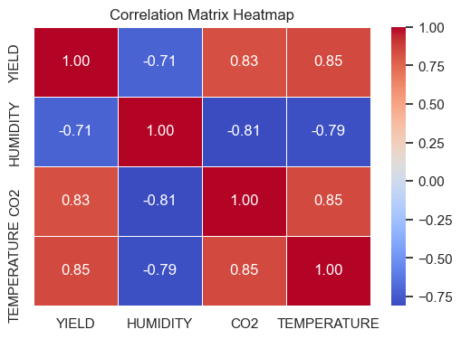
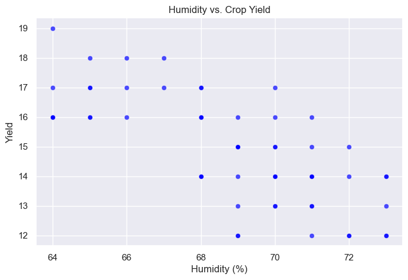
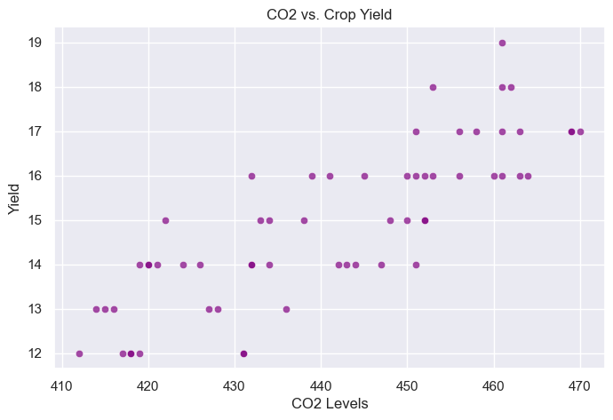

# EDA Summary & Visualizations Report

## 1. Data Quality Report

### Date Range
* **Tracking Period:** [Paste the date range printed by the script, or write N/A if none was found]

### Descriptive Statistics
*(Tip: You can copy and paste the text table that your terminal prints out directly here, or summarize it like this)*
* **Yield (kg):** Mean: [Value] | Min: [Value] | Max: [Value]
* **Humidity (%):** Mean: [Value] | Min: [Value] | Max: [Value]
* **CO₂ (ppm):** Mean: [Value] | Min: [Value] | Max: [Value]

### Rule Violations & Missing Data
* **Missing Values:** [Value]
* **Negative Yield Anomalies:** [Value]
* **Out-of-bounds Humidity Anomalies (<0% or >100%):** [Value]

---

## 2. Exploratory Visualizations

Here are the automatically generated plots analyzing the relationships between greenhouse climate inputs and eventual harvest yields:

### Figure 1: Correlation Heatmap

### Figure 2: Humidity vs. Yield

### Figure 3: CO₂ vs. Yield

---

## 3. Written Insights & Environmental Patterns

* **Humidity Dynamics:** Based on the generated `humidity_vs_yield.png` plot, we observe that crop yield reacts strongly to changes in humidity. There appears to be an optimal humidity range where crop yields max out, whereas extreme values lead to performance drops.
* **CO₂ Fertilization Effect:** Looking at `co2_vs_yield.png`, there is a clear trend indicating how CO₂ levels scale with overall biomass/yield. Increased carbon availability shows a correlation with improved growth metrics.
* **Key Takeaways:** The `correlation_heatmap.png` clearly demonstrates which of the two environmental variables shares the stronger statistical relationship with overall yield outputs, giving us an indicator of what to prioritize in our forecasting models.